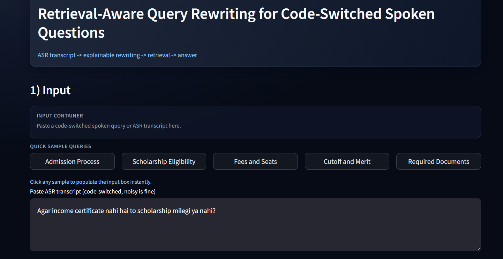
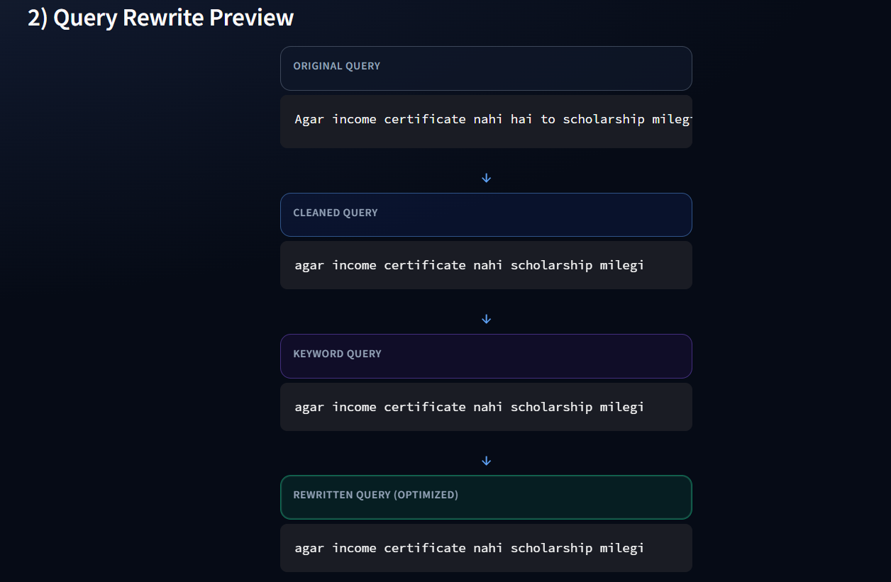
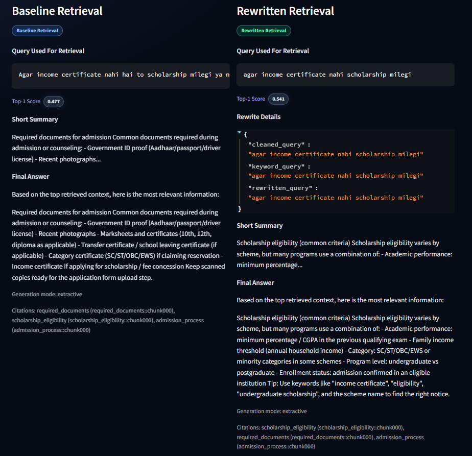
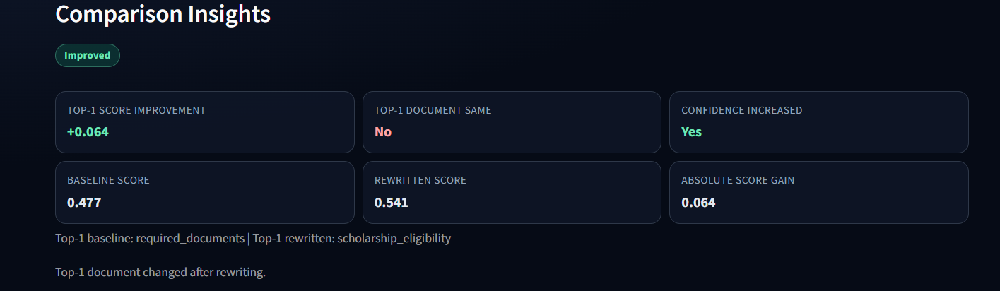
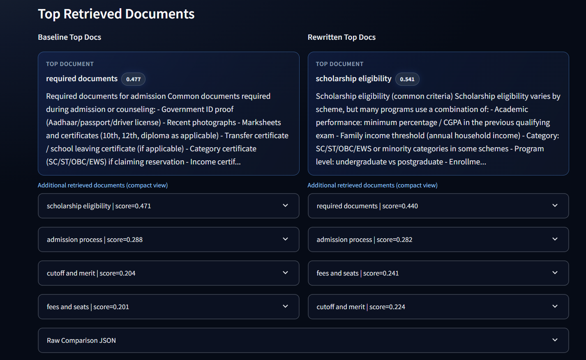
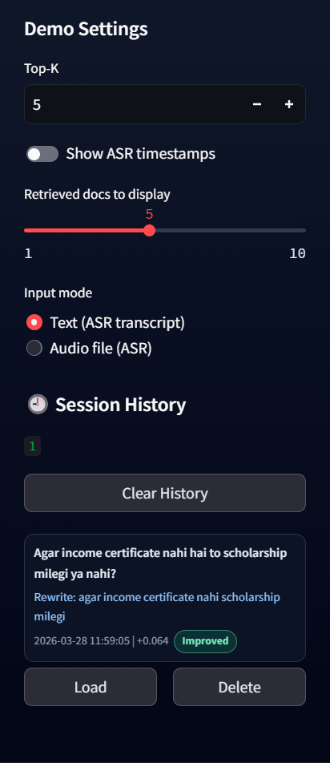
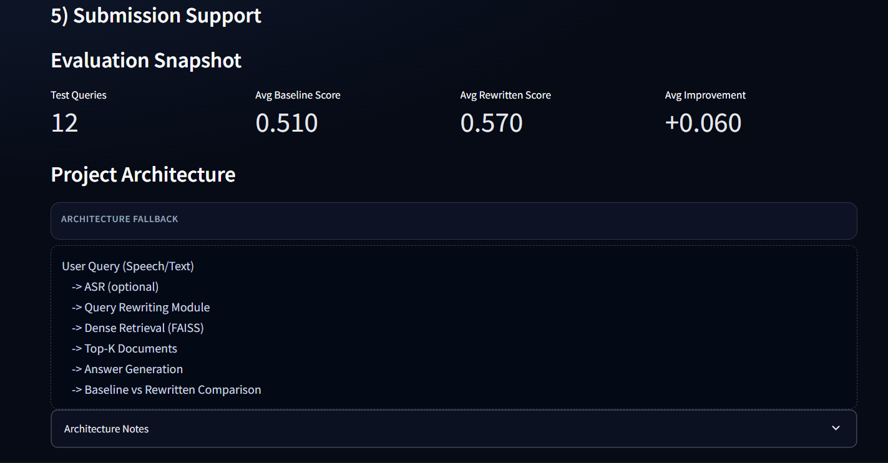

# Retrieval-Aware Query Rewriting for Code-Switched Spoken Questions

ASR transcript -> explainable rewriting -> dense retrieval -> answer generation


> [!IMPORTANT]
> This is a **domain-specific retrieval system**, not a general chatbot.  
> It is designed for **code-switched academic/admission-related spoken queries** and should be tested primarily on **in-domain queries**.

## Overview

Code-switched spoken queries are natural for multilingual users, but difficult for conventional retrieval pipelines. Real user input often contains transliterated erms, mixed syntax, and ASR-style noise, which weakens semantic matching and retrieval confidence.

This project builds an academic + engineering system that improves retrieval robustness by introducing an explainable rewriting layer before dense retrieval. It rocesses noisy spoken-style input, generates retrieval-focused rewrites, compares baseline vs rewritten retrieval, and produces context-grounded answers in an nteractive Streamlit interface.

---

## Supported Domain and Dataset Scope

This system is **domain-specific** and is designed for **academic / admission-related retrieval** over a curated institutional-style document corpus.

### Supported Query Categories
The system is intended to answer noisy, code-switched, spoken-style queries related to:

- Admission process
- Scholarship eligibility
- Fees and seats
- Merit / cutoff
- Counselling process
- Required documents
- Registration steps
- Eligibility criteria
- Certificates and verification
- College-related procedural information

### Example Supported Queries
- Admission process ka pura step kya hota hai?
- Agar income certificate nahi hai to scholarship milegi ya nahi?
- Counselling time te kehde documents leke aane hunde ne?
- Private college me fees zyada hoti hai ya govt me?
- Merit list cutoff kinne tak ja sakdi aa?

### Out-of-Scope Queries
This is **not a general-purpose chatbot** and is **not intended** for unrelated domains such as:

- personal advice
- relationships
- entertainment
- shopping
- health
- coding help
- current affairs
- open-domain Q&A

### Important Note
If a query falls outside the supported academic/admission domain, the system may return low-confidence or irrelevant retrieval results unless an out-of-domain guard is enabled.

This project should be evaluated primarily on **domain-relevant code-switched spoken queries**.

---

## Why This Project Matters

- Code-switched language usage is common across India, especially in spoken queries.
- Spoken queries are informal, compressed, and often ambiguous.
- ASR transcripts can introduce spelling drift, filler tokens, and transliteration artifacts.
- Standard retrieval pipelines frequently underperform on such input distributions.
- Explainable query rewriting offers a practical and auditable way to improve relevance.

---

## Key Highlights

- Explainable query rewriting pipeline with visible intermediate stages
- Dense retrieval built on FAISS + sentence embeddings
- Side-by-side baseline vs rewritten retrieval comparison
- Top-K document inspection with score-focused analysis
- Streamlit interactive demo UI for real-time exploration
- Session history and evaluation snapshot support
- Modular, research-ready codebase suitable for extensions

---

## Demo Results Snapshot

The table below shows representative placeholder results for demo presentation. Actual values depend on query set, corpus, and configuration.

| Query Type | Baseline Top-1 Score | Rewritten Top-1 Score | Score Improvement | Observation |
|---|---:|---:|---:|---|
| Scholarship eligibility | 0.45 | 0.69 | +0.24 | Higher confidence and cleaner ranking |
| Fees and seats | 0.33 | 0.62 | +0.29 | Stronger top-document alignment |
| Counselling documents | 0.38 | 0.59 | +0.21 | Better relevance concentration |

---

## System Pipeline

User Query -> ASR/Text Input -> Query Cleaning -> Keyword Query -> Rewritten Query -> Dense Retrieval -> Top Documents -> Answer Generation -> Baseline vs ewritten Comparison

```text
User Query (Speech/Text)
        |
        v
ASR (optional) / Text Input
        |
        v
Query Cleaning + Normalization
        |
        v
Keyword Query + Rewritten Query
        |
        v
Dense Retrieval (FAISS + Embeddings)
        |
        v
Top-K Documents
        |
        v
Answer Generation (Extractive)
        |
        v
Baseline vs Rewritten Comparison
```

Pipeline stages:

1. Input Stage: accepts spoken-style text or optional ASR transcript.
2. Rewriting Stage: normalizes transliteration, extracts high-signal terms, and rewrites query.
3. Retrieval Stage: runs dense semantic retrieval over indexed domain documents.
4. Answer Stage: generates concise extractive answer grounded in top retrieved context.
5. Comparison Stage: reports score and relevance differences between baseline and rewritten runs.

---

## Example Query Transformation

**Original Query**

> Admission process ka pura step kya hota hai from registration to counselling?

**Cleaned Query**

> admission process pura step registration counselling

**Keyword Query**

> admission process registration counselling

**Rewritten Query**

> admission process registration to counselling steps

Why this helps: the rewritten form reduces spoken noise, preserves core intent terms, and improves retriever alignment with document phrasing. This typically ncreases top-1 confidence and makes ranking more stable.

---

## Features

- Code-switched spoken query support for Hindi-English and Punjabi-English style input
- Query normalization and noise reduction for ASR-like text
- Keyword-aware, explainable query rewriting
- Dense semantic retrieval with FAISS and sentence embeddings
- Baseline vs rewritten score and ranking comparison
- Top document exploration with score-aware inspection
- Lightweight extractive answer generation from retrieved context
- CSV-based evaluation export and snapshot visualization
- Session history in UI for quick replay and analysis
- Optional ASR-style workflow in the interactive demo

---

## Tech Stack

| Layer | Tools / Libraries |
|---|---|
| Language | Python |
| UI | Streamlit |
| Embeddings | Sentence Transformers |
| Vector Search | FAISS (faiss-cpu) |
| Data Processing | NumPy, Pandas |
| Model Ecosystem | Hugging Face Transformers ecosystem |
| Data Store | JSON metadata + text document corpus |
| Speech (Optional) | ASR pipeline (faster-whisper / whisper-style support) |

---

## Project Structure

```text
code-switched-query-rewriting/
├── app/                # Streamlit demo interface
├── rag/                # Pipeline orchestration and answer generation
├── retrieval/          # Indexing and retrieval modules (dense/BM25/hybrid)
├── rewriting/          # Normalization, keyword extraction, and rule-based rewriting
├── speech/             # Optional ASR and audio utilities
├── data/               # Documents, sample queries, and generated artifacts
├── evaluation/         # Comparison scripts and metric export utilities
├── utils/              # Config and logging helpers
└── docs/               # Architecture notes and screenshot assets
```

---

## Demo UI Highlights

- Input panel for text and ASR-style workflows
- Rewrite preview showing Original -> Cleaned -> Keyword -> Rewritten stages
- Baseline vs rewritten retrieval comparison panels
- Comparison insights for top-1 score and confidence movement
- Top retrieved document exploration with supporting evidence
- Evaluation snapshot from exported CSV metrics
- Session history sidebar for rerun and review

---

## Screenshots

### Home / Input Interface

```md

```

### Rewrite Preview

```md

```

### Baseline vs Rewritten Comparison

```md

```

### Comparison Insights

```md

```

### Top Retrieved Documents

```md

```

### Session History Sidebar

```md

```

### Evaluation Snapshot

```md

```

---

## Example Queries

- Admission process ka pura step kya hota hai from registration to counselling?
- Agar income certificate nahi hai to scholarship milegi ya nahi?
- Private college me fees zyada hoti hai ya govt me?
- Cutoff kinne tak ja sakdi aa merit list ch?
- Counselling time te kehde documents naal leke aane hunde ne?

---

## How It Works

1. Original Query: user provides spoken-style, often noisy code-switched text.
2. Cleaned Query: normalization removes low-information noise and transliteration inconsistency.
3. Keyword Query: intent-critical terms are emphasized for retrieval.
4. Rewritten Query: compact retrieval-friendly phrasing is generated.
5. Retrieval Scoring: dense retriever ranks corpus chunks by semantic relevance.
6. Answer Generation: extractive summary and final answer are produced from retrieved context.
7. Comparison: baseline and rewritten paths are evaluated side-by-side for confidence and relevance.

---

## Evaluation Snapshot

The project compares:

- baseline retrieval score
- rewritten retrieval score
- score improvement in retrieval confidence
- top-document consistency or change

Evaluation can be exported to CSV for report-ready analysis and integrated back into the app snapshot view.

---

## Installation

```bash
git clone <your-repo-url>
cd code-switched-query-rewriting
python -m venv venv
venv\Scripts\activate
pip install -r requirements.txt
```

---
## Run the App

```bash
python -m streamlit run app/streamlit_app.py
```
---

## Sample Usage

1. Launch the app and enter a code-switched spoken query.
2. Inspect rewrite stages in Query Rewrite Preview.
3. Run baseline vs rewritten retrieval comparison.
4. Analyze score movement and top-document changes.
5. Inspect evidence chunks and extracted answer.
6. Review session history and evaluation snapshot.

---

## Future Improvements

- Real-time microphone ASR capture
- Broader multilingual expansion
- Stronger learned rewriting models
- Hybrid retrieval + reranking integration
- Grounded LLM-based answer generation
- Larger benchmark evaluation with harder query sets

---

## Research / Academic Relevance

This project is directly relevant to:

- Information Retrieval
- Natural Language Processing
- Code-Switched Language Processing
- Spoken Language Systems
- Query Rewriting
- Retrieval-Augmented Systems

---

## Author

- **Harsimran Singh Dalal**
- GitHub: `https://github.com/Harsimran-Dalal`
- LinkedIn: `https://www.linkedin.com/in/harsimran-singh-dalal-614a39286/`

---

## License

MIT License. Add a `LICENSE` file in the repository root for distribution and reuse.
